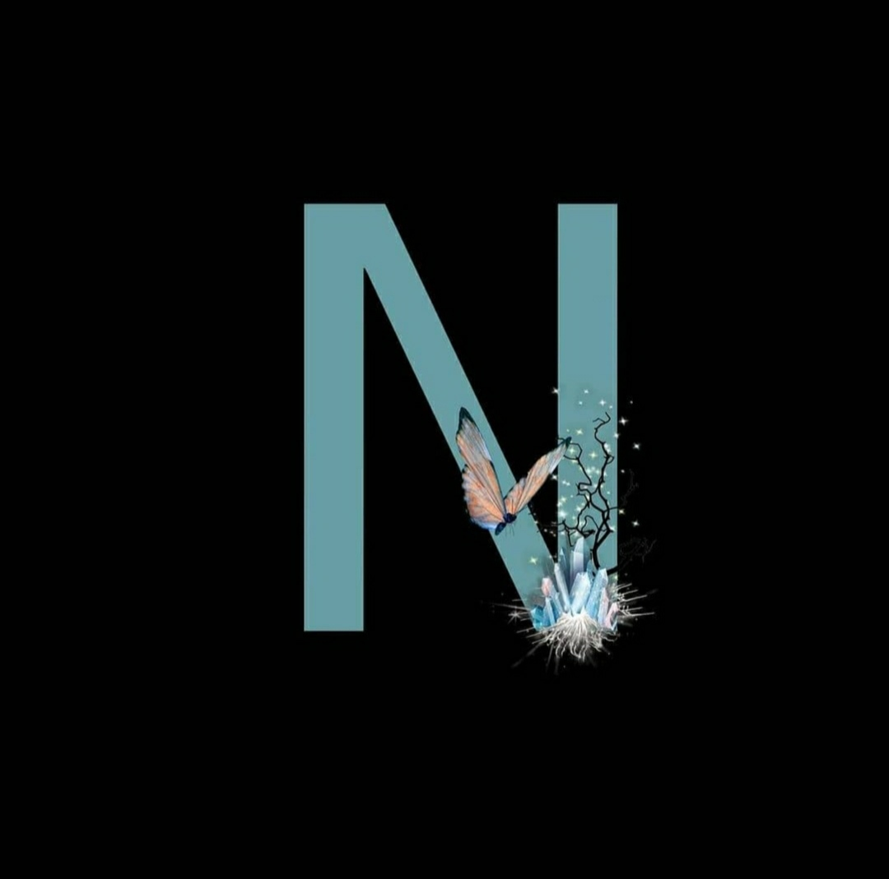

# PROJECT-1
@@ -0,0 +1,40 @@
<!DOCTYPE html>
<html>
  <head>
    <meta charset="utf-8">

    <title>Project</title>
    <link href="style.css" rel="stylesheet" type="text/css" />
  </head>
  <body>
    <section id="main">
      <nav class="nav-bar">
         

         

         <ul class="manu">
          <li><a href="#">home</a></li>
          <li><a href="#">skills</a></li>
          <li><a href="#">recent</a></li>    
          <li><a href="#">client</a></li>
          <li><a href="#">contac</a></li>
         </ul>
         <a href="#" class="hey">Say Hi!</a>
      </nav>
    </section>

    

      

        
      

      

        <h1>Hello, This Is About   Nature</h1>
        
Hey in this video i will be showing you guys how to build a website using only HTML and CSS

        <a href="#" class="resume-btn">See More</a>
      

    

  </body>
</html> 
 123  style.css 
@@ -0,0 +1,123 @@
* {
box-sizing: border-box;
}

body {
  margin: 0px;
  padding: 0px;
  font: poppins;
}

#main {
  width: 100%;
  height:50vh;
  position: relative;
}

nav {
 display: flex;
 background-color: white;
 justify-content: space-around;
 align-items: center;
 position: fixed;
 top: 0;
 left: 0;
 width: 100%;
 box-shadow: 5px 10px 30px rgba(0,0,0,0.02);
 z-index: 1;
}

.manu {
 display: flex;
 list-style: none;
}

.manu li a {
  height: 40px;
  line-height: 43px;
  margin: 3px;
  padding: 0px 22px;
  font-size: 0.8em;
  text-transform: uppercase;
  font-weight: 500;
  letter-spacing: 1px;
  color: grey;
  display: flex;
}
.logo img {
  height: 45px;
}

a {
  text-decoration: none;
}

.hey {
  color: #39bfbd;
  font-weight: 500;
  font-size: 0.9em;
  border-bottom: 2px solid #39bfbd;
}

.image {
  width: 550px;
  height: 550px;
}

.image img {
  width: 100%;
  height: 100%;
  object-fit: contain;

}

.content {
  display: flex;
  width: 90%;
  justify-content: space-around;
  align-items: center;
  position: absolute;
  left: 6%;
  right: 100%;
  top: 9%;

}

.main-text {
  width: 500px;
  margin-left: 60px;
}

.main-text h1 {
  font-size: 3em;
  color: #1c3548;
  margin: 0px 0px 10px 0px;
  line-height: 60px;
}

.main-text p {
  color: grey;
}

.resume-btn {
  width: 190px;
  height: 44px;
  display: flex;
  justify-content: center;
  align-items: center;
  color: white;
  background-color: #1db096;
  border-radius: 20px;
  box-shadow: 5px 10px 30px rgba(24, 139, 119, 0.2);
}

.resume-btn:hover {
  background-color: #23cdaf;
  transition: all else 0.2s;
}

.manu li a:hover {
  background-color: #23cdaf;
  color: white;
  box-shadow: 5px 10px 30px rgba(24, 139, 119, 0.2);
} 
